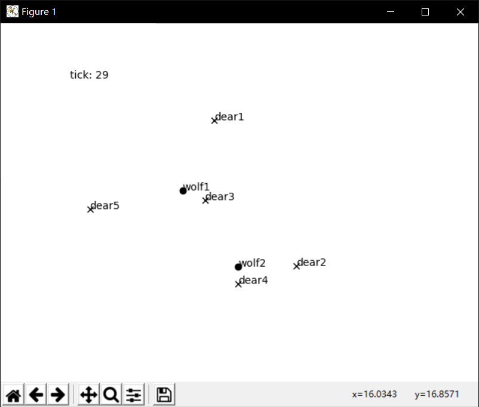

# 追逃模型
这是一个基于Python的可拓展的追逃模型。例子可见`examples.py`。

# 基于规则定义
在这个模型中，规则（Rule）可以决定世界生物的生成规律，捕食链，移动规则等等。
定义新的规则很简单，只需要实现`WithRule`接口即可。覆写的rule()方法决定了某个瞬间各个生物的生成和运动趋势。

若要使用修饰器，修饰器的抽象类实现`WithRule`接口即可。

目前已经提供的规则：
- CatchRule: 捕食者会追逐猎物
- EscapeRule: 猎物会逃脱
- EatRule: 追上后的捕食行为
- PrintRule: 打印计算结果的规则
- PlotRule: 可视化规则
- RandomWalkRule: 随机行走规则，作为示例在example中

# 引入时间
某些自然变动的量可以直接通过类实现`WithTime`接口实现，Animal类实现了该接口，可以根据设定的速度值随着时间的流逝移动自身。

规则本身也实现了`WithTime`接口，在定制规则时，您只要专注于某一时刻各个对象的位置、状态和运动趋势即可。